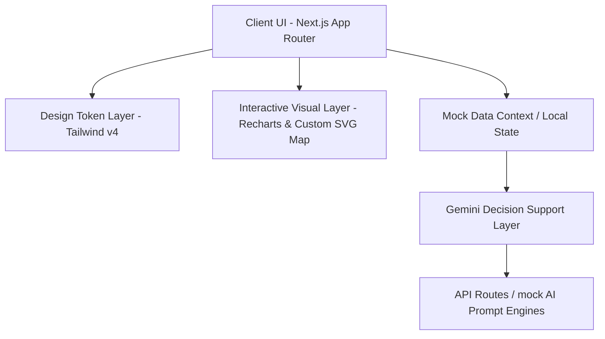

# System Architecture & Technical Flow Diagram

## 🏗️ Structural Layers

1. **Client Workspace**: Developed using Next.js 16 and React 19 Client components to handle interactivity and browser layout renders.
2. **Design Tokens**: Standardized colors (primary blue, accent gold) and glassmorphism parameters handled via Tailwind v4 `@theme inline`.
3. **Data Grid**: Complete mock schemas covering all coordinates (gates, section seats, concession outlets, threat indicators).
4. **AI Solver**: Built-in prompt engineering templates acting as decision support desks for crowd redirects, triage steps, and restock logs.
