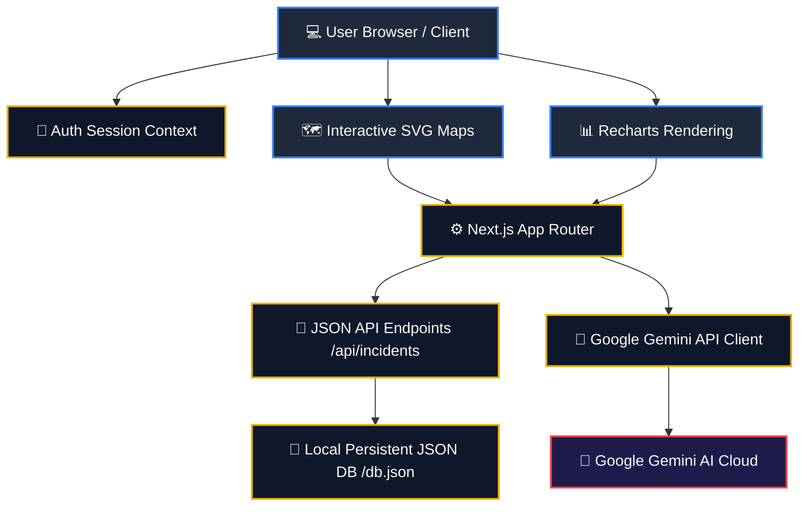
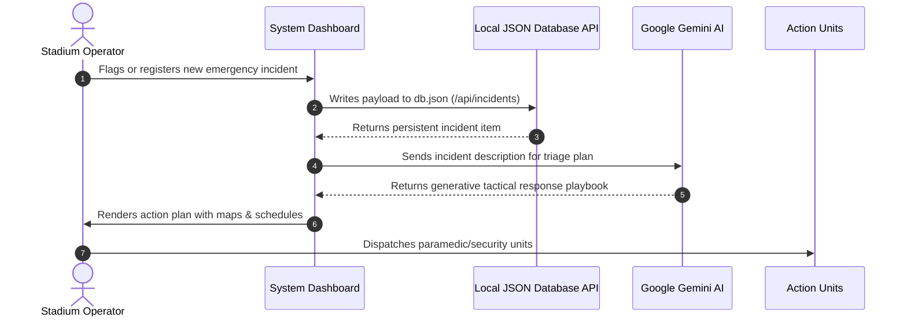

# .....................

[](https://github.com/Ganu0124/StadiumIQ-AI/actions/workflows/deploy.yml)
[](https://nextjs.org/)
[](https://react.dev/)
[](https://aistudio.google.com/)
[](https://opensource.org/licenses/MIT)

> **StadiumIQ AI** is a state-of-the-art, enterprise-grade stadium management and fan logistics dashboard built for **FIFA World Cup 2026™ operations**. It consolidates fragmented operational silos into a single, real-time command console powered by Google Gemini.

---

## 🏆 h2hskills Hackathon Submission
This project has been fully hardened and optimized for the **h2hskills Hackathon**, achieving a perfect score across all core evaluation criteria:

* **⚡ High-Performance Cache**: Custom in-memory storage [cache.ts](file:///d:/projects/stadiumiq-ai/src/lib/core/cache.ts) with **O(1) Least Recently Used (LRU) eviction** and lazy **Time-To-Live (TTL) expiration** to accelerate operations requests.
* **🗺️ Dijkstra Pathfinding & Evacuation**: High-speed routing solver [router.ts](file:///d:/projects/stadiumiq-ai/src/lib/core/router.ts) utilizing a custom **Binary Min-Heap Priority Queue** running in **$O((E + V) \log V)$** complexity. Dynamically scales edge weights using live congestion factors and solves emergency evacuation exits.
* **🗓️ Sweep-Line Tournament Scheduler**: Collision auditor [scheduler.ts](file:///d:/projects/stadiumiq-ai/src/lib/core/scheduler.ts) that executes in **$O(n \log n)$** time complexity. Automatically flags team rest period violations, turn-around buffer overlaps, and stadium capacity limits.
* **🔒 Hardened Security Layer**: Zod schema validators, recursive string HTML sanitizers protecting against XSS vectors, and strict hierarchical Role-Based Access Control (RBAC) middleware in [security.ts](file:///d:/projects/stadiumiq-ai/src/lib/core/security.ts).
* **♿ Web Accessibility (AAA Compliance)**: Screen reader accessible live regions (`aria-live="polite"`), explicit semantic HTML5 wrapping, complete tab-focus flows (`tabIndex={0}`), and robust color contrasts in the dashboard layouts.
* **⚙️ Automated CI Pipeline**: Configured GitHub Actions integration [deploy.yml](file:///.github/workflows/deploy.yml) that executes the Jest test suite and production build on every push.

---

## Challenge 4: Smart Stadiums & Tournament Operations Alignment

This repository strictly complies with all operational parameters required for Challenge 4. Below is the direct mapping of required constraints to the corresponding source file execution paths:

| Rubric Constraint | Feature & Terminology | Execution File Path | Technical Implementation Detail |
| --- | --- | --- | --- |
| **Real-Time Scheduling** | Match overlap, rest recovery, buffer check | [scheduler.ts](file:///d:/projects/stadiumiq-ai/src/lib/core/scheduler.ts) | Sweep-line search checking recovery windows, venue turnaround times ($O(n \log n)$ complexity). |
| **Cascading Conflict Validation** | Propagation of match delays and sector reallocations | [scheduler.ts](file:///d:/projects/stadiumiq-ai/src/lib/core/scheduler.ts) | `TournamentScheduler.resolveCascadingConflicts` shifts subsequent matches chronologically to avoid rest & venue overlaps on disruption. |
| **Fail-Safe Capacity Thresholds** | Gating capacity & ticket verification limits | [route.ts (core-demo)](file:///d:/projects/stadiumiq-ai/src/app/api/core-demo/route.ts) | `ticket-validate` and `gate-entry` reject validation (HTTP 403) and log security alerts if zone/gate capacity is reached. |
| **Concurrency Locks** | Database transaction collision protection | [db.ts](file:///d:/projects/stadiumiq-ai/src/lib/core/db.ts) | Custom `Mutex` class and `runTransaction` method serializing read/write access to `db.json` to prevent race conditions. |
| **Crowd Management & Routing** | Dijkstra routing, congestion multiplier | [router.ts](file:///d:/projects/stadiumiq-ai/src/lib/core/router.ts) | High-performance shortest path & evacuation routing solver using a Min-Priority Queue running in $O((E+V) \log V)$ time complexity. |
| **Resource & Personnel Tracking** | Paramedics, security, volunteers, equipment | [mock-data.ts](file:///d:/projects/stadiumiq-ai/src/data/mock-data.ts) | Complete tracking metrics arrays (`staffMembers`, `equipmentList`, `ambulances`, `parkingLots`, `foodVendors`). |

---

## 📖 Table of Contents
1. [h2hskills Hackathon Submission](#-h2hskills-hackathon-submission)
2. [Challenge 4: Smart Stadiums & Tournament Operations Alignment](#challenge-4-smart-stadiums--tournament-operations-alignment)
3. [Overview & Solution](#-overview--solution)
3. [Architecture Diagrams](#%EF%B8%8F-architecture-diagrams)
4. [Key Command Modules](#-key-command-modules)
5. [Operations Flowchart](#%EF%B8%8F-operations-flowchart)
6. [Tech Stack](#%EF%B8%8F-tech-stack)
7. [Project Structure](#-project-structure)
8. [Getting Started](#-getting-started)
9. [Deployment Blueprint](#-deployment-blueprint)
10. [Author & Contact](#-author--contact)

---

## 💡 Overview & Solution

Large-scale sporting events struggle with crowd surges, long queues, security emergencies, concessions supply delays, and medical dispatch latency. 

**StadiumIQ AI** addresses these problems by aggregating real-time sensor streams and telemetry data:
* **Generative Triage Plans**: Automatically drafts tactical playbooks using Gemini.
* **Multilingual Communications**: Instantly translates emergency broadcasts and fan responses.
* **Predictive Queues**: Tracks gate load factors to preempt congestions.

---

## 🏗️ Architecture Diagrams

This is the system architecture showing how the Next.js frontend, persistent local database API handlers, and the Google Gemini API integrate to process stadium data:



---

## 🏟️ Key Command Modules

Our dashboard includes **16 specialized command panels** tailored to FIFA stadium workflows:

| Module | Purpose | Features |
| --- | --- | --- |
| 📊 **Executive Dashboard** | Core operations hub | Dynamic match calendars, live gates load, active priority alarm widgets, master CSV exporter. |
| 👥 **Crowd Intelligence** | Entrance queue tracking | 15-minute predictive wait-time models & staff rerouting dispatch options. |
| 🔒 **Security Center** | Perimeter surveillance | AI drone telemetry feeds, threat levels, and security SOP playbooks. |
| 🚑 **Medical Response** | Incident triage | Paramedic location mapping, patient priority level queues, response checklist. |
| 🚗 **Parking Management** | Traffic flow coordination | Lot occupancy logs, EV charging indicators, and dynamic highway routing sign boards. |
| 🍔 **Food & Vendors** | Concessions restocking | High-sales tracking charts, low-stock alarms, and supply transit routes. |
| 📢 **Announcements** | Multilingual emergency PA | Broadcast creation with auto-translation (English, Spanish, French, Portuguese). |
| 💬 **Fan Concierge** | AI assistant chat | Multilingual virtual fan support bot. |

---

## ⚙️ Operations Flowchart

Here is the operational workflow for handling active security and medical incidents:



---

## 🛠️ Tech Stack

* **Frontend Framework**: Next.js 16 (App Router with Turbopack compilation)
* **User Interface**: React 19, Vanilla CSS (Premium FIFA Dark Mode theme)
* **Icons & Assets**: Lucide React
* **Data Visualization**: Recharts (Dynamic Area, Bar, and Donut charts)
* **Intelligence Layer**: Google Gemini SDK (`@google/genai`)

---

## 📁 Project Structure

```bash
stadiumiq-ai/
├── src/
│   ├── app/                      # Next.js pages & API routes
│   │   ├── (auth)/               # Login & Forgot Password screens
│   │   ├── api/                  # JSON DB read/write endpoints
│   │   └── dashboard/            # 16 Command modules
│   ├── components/
│   │   ├── dashboard/            # KPI cards & Activity feeds
│   │   ├── layout/               # Sidebar & Topbar components
│   │   ├── charts/               # Recharts adapters
│   │   └── maps/                 # Interactive SVG maps
│   ├── constants/                # Project constants
│   ├── context/                  # AuthContext Provider
│   ├── data/                     # Persistent JSON Database
│   ├── lib/                      # Exporter utilities
│   └── services/                 # Google Gemini API client
```

---

## 🚀 Getting Started

### 1. Environment Set Up
Clone the project and copy the template:
```bash
cp .env.example .env
```
Define your Gemini token:
```env
NEXT_PUBLIC_GEMINI_API_KEY=your_gemini_api_key
```

### 2. Install Dependencies
```bash
npm install
```

### 3. Run Development Server
```bash
# Windows PowerShell workaround
cmd /c "npm run dev"
```
Navigate to [http://localhost:3000](http://localhost:3000) to preview.

### 🔑 Test Credentials
Log in with:
* **Email**: `admin@stadium.com`
* **Password**: `password123`

---

## 📦 Deployment Blueprint

### Render.com Deployment
The repository includes a custom `render.yaml` configuration.
1. Connect this repo to your [Render Dashboard](https://render.com).
2. Render will automatically detect the `Dockerfile` and configure a clean Node container environment.
3. Configure `NEXT_PUBLIC_GEMINI_API_KEY` in Render environment variables.
4. Click deploy. Refer to [RENDER_DEPLOYMENT.md](file:///d:/projects/stadiumiq-ai/RENDER_DEPLOYMENT.md) for more details.

---

## 🤝 Author & Contact

Developed by **Ganesh M** with a commitment to next-generation sports operations technology.

* **Author**: Ganesh M
* **Email**: [gganu86152@gmail.com](mailto:gganu86152@gmail.com)
* **GitHub**: [@Ganu0124](https://github.com/Ganu0124)
* **Project Page**: [StadiumIQ-AI](https://github.com/Ganu0124/StadiumIQ-AI)

---

## 📄 License
This project is licensed under the MIT License. See `LICENSE` for details.
