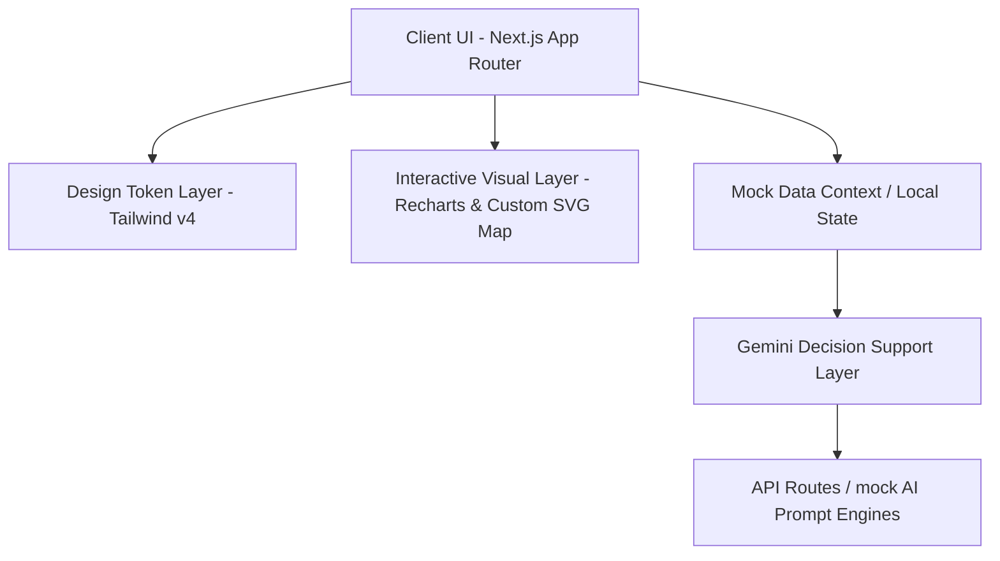

<<<<<<< HEAD
# StadiumIQ AI 🏟️🤖

> **AI-Powered Smart Stadium Operations & Fan Experience Platform** built for FIFA World Cup 2026™ Operations.

StadiumIQ AI is a production-ready, enterprise-grade stadium management dashboard designed to coordinate crowd logistics, surveillance security alerts, medical incident triage, traffic/parking rerouting, and vendor concession levels during major sporting events.

---

## 📖 Problem Statement

Large sporting events face severe operational challenges including crowd congestion, long gate queues, emergency coordination, multilingual communication gaps, parking traffic congestion, security perimeter threats, food concession stockouts, and sensor telemetry fragmentation. Legacy systems are siloed and lack automated decision support desks.

---

## 💡 Solution

StadiumIQ AI unifies data grids (gates, seats, EV parking lot, concession outlets, threat indicators) into a single, cohesive command console powered by Google Gemini. The platform processes logs and automatically creates action playbooks, medical triages, and translation texts.

---

## 🌟 Features

* **Executive Dashboard**: Consolidated control console tracking current attendance, gate speed metrics, active medical emergencies, and overall AI risk score.
* **Interactive SVG Map**: Stand occupancy heat indicators, restroom/food amenities markers, and emergency exit routes.
* **Predictive Crowd Logistics**: Gate queue forecasts (15-60m forecast models) suggesting staff dispatch and lane openings.
* **Incident Command**: Timelines tracking active alarms with Gemini-generated triage plans and incident briefs.
* **Surveillance Co-Pilot**: Camera feeds alerting staff on drone operators or badge forgeries.
* **Transit & Parking**: Lot capacities, walking offsets, charging indicators, and digital highway routing signs.
* **Concession Restocking**: Concourse vendor sales tracking with cargo redistribution guides.
* **Multilingual Broadcast**: PA scoreboard announcement draft translations (English, Spanish, French, Portuguese).
* **Fan Chatbot Helper**: Conversational concierge mapping seat navigation, nearest restrooms, or emergency assistance.

---

## 🏗️ System Architecture



1. **Client Workspace**: Next.js 16 / React 19 client templates.
2. **Design Tokens**: Standardized colors (primary blue, accent gold) and glassmorphism parameters handled via Tailwind v4 `@theme inline`.
3. **Data Grid**: Mock schemas mapping coordinates (gates, seats, parking EV slots, concessions).
4. **AI Solver**: Prompt engineering templates acting as decision desks for redirects, triages, and announcements.

---

## 📂 Project Structure

```
stadiumiq-ai/
├── .github/
│   ├── ISSUE_TEMPLATE/
│   │   └── bug_report.md
│   ├── pull_request_template.md
│   └── workflows/
│       └── deploy.yml
├── docs/                         # Additional system documentation
├── public/                       # Icons, Static Assets
├── src/
│   ├── app/                      # Next.js App Router Layout & pages
│   │   ├── (auth)/               # Login & recovery
│   │   ├── dashboard/            # 16 Interactive Dashboard pages
│   │   │   ├── analytics/
│   │   │   ├── announcements/
│   │   │   ├── crowd/
│   │   │   ├── fan-concierge/
│   │   │   ├── food-vendors/
│   │   │   ├── incident-management/
│   │   │   ├── live-map/
│   │   │   ├── medical/
│   │   │   ├── operations/
│   │   │   ├── parking/
│   │   │   ├── profile/
│   │   │   ├── reports/
│   │   │   ├── security/
│   │   │   ├── settings/
│   │   │   └── page.tsx
│   │   ├── globals.css           # Tailwind + Glassmorphism styles
│   │   └── page.tsx              # Landing page
│   ├── components/
│   │   ├── layout/               # Sidebar & Topbar panels
│   │   ├── ui/                   # Button, Card, Badge, Progress UI
│   │   ├── charts/               # Recharts adapters
│   │   └── maps/                 # SVG maps
│   ├── constants/                # Constants re-exports
│   ├── context/                  # AuthContext Provider
│   ├── data/                     # Mock statistics schemas
│   ├── hooks/                    # useAuth Hooks
│   ├── lib/                      # Core constants & utils
│   ├── services/                 # Gemini API clients
│   ├── types/                    # TypeScript interfaces
│   └── utils/                    # Utilities index
├── Dockerfile                    # Multi-stage production container configuration
├── docker-compose.yml            # Local scaling configuration
├── package.json
└── tsconfig.json
```

---

## 🚀 Installation & Environment Configuration

1. **Copy the Environment Template**:
   ```bash
   cp .env.example .env
   ```

2. **Define Variables**:
   ```env
   NEXT_PUBLIC_GEMINI_API_KEY=your_gemini_api_key_here
   ```

3. **Install Packages**:
   ```bash
   npm install
   ```

4. **Launch Server**:
   ```bash
   npm run dev
   ```
   Open [http://localhost:3000](http://localhost:3000) in your browser.

---

## ⚡ API Documentation

### 1. Incident Decision Support
* **Endpoint**: `/api/ai/summarize`
* **Method**: `POST`
* **Response**:
  ```json
  {
    "summary": "AI Summary: Critical crowd surge at Gate B1...",
    "recommendation": "Open auxiliary lanes and redirect traffic..."
  }
  ```

---

## 📦 Deployment Guide

### Vercel Deployment
1. Connect repository on [Vercel Dashboard](https://vercel.com).
2. Configure `NEXT_PUBLIC_GEMINI_API_KEY` in environment variables settings.
3. Deploy.

### Render Deployment
1. Deploy with one-click on [Render](https://render.com) using the connected `render.yaml` blueprint.
2. Refer to [RENDER_DEPLOYMENT.md](file:///d:/projects/stadiumiq-ai/RENDER_DEPLOYMENT.md) for step-by-step guides.

### Google Cloud Run Deployment
1. Build container image:
   ```bash
   docker build -t gcr.io/[PROJECT-ID]/stadiumiq-ai:latest .
   ```
2. Push container to Artifact Registry:
   ```bash
   docker push gcr.io/[PROJECT-ID]/stadiumiq-ai:latest
   ```
3. Deploy to Cloud Run:
   ```bash
   gcloud run deploy stadiumiq-ai --image gcr.io/[PROJECT-ID]/stadiumiq-ai:latest --platform managed
   ```

---

## 📄 License

Distributed under the MIT License. See `LICENSE` for details.
